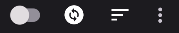
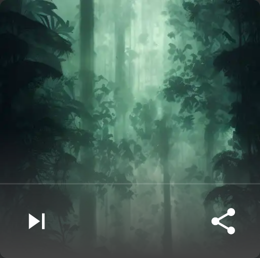

# wallpaperer
A home screen wallpaper changer app for Android.

## Summary
The Wallpaperer workflow is simple:
1. Add images using the (+) button, or share images from other apps to Wallpaperer
2. Toggle the changer control to the *on* position
3. Set your desired wallpaper changing delay/interval in the app settings (default: 15 minutes)

## Features
 Touch this button to add a new image to the library. All images added to Wallpaperer are copied to the app and will remain even if the original source is deleted. A white ring around the button indicates progress toward the next scheduled wallpaper change.

* When the toggle is enabled the home screen wallpaper will be changed to the next image on a customizable time interval (see: Settings)
* Touch the cycle control to immediately change the home screen wallpaper to the next image (from this app's gallery)
* Switch the view between the customizable list of cards and other lists that sort the cards based on different criteria, e.g., name, date, and size.

* The *next* button appears on every image card. Touch it to immediately change the home screen wallpaper to the card's image.
* The *share* button appears on every image card. Touch it to share the card's image with another app. NOTE: The image that is sent may have been recompressed and be lower quality than the original source (see: Settings).
* Tap the card to view a fullscreen preview of the image.
* Drag cards to re-order them (only in the *custom* view).
* Swipe the card off the screen to delete it from the gallery. NOTE: This will delete the copy of the image maintained by Wallpaperer. It **does not** delete the original source that was added/shared to the gallery. There is a short time where you can press *UNDO* after swiping away an image.

### Other features
* Share an image from any app to Wallpaperer. Sharing an image to this app will create a copy of the image in the Wallpaperer gallery.
* Scroll quickly by dragging the scroll bar thumb.

## Settings

### Thumbnail columns
Set the maximum number of image thumbnails you want to see on each row in the gallery. Depending on screen size and dpi, the app may display fewer thumbnails per row than is specified in this preference. This is simply to leave enough room in the thumbnail for the action buttons.

### Show wallpaper metadata
Some info about the image, including size, filename, and image type is displayed in the thumbnail.

### Crop image to fill screen
When enabled, the image will be stretched (maintaining image aspect ratio) to eliminate any black bars (letterboxing), cropping out portions of the image as necessary. Disable if you want the entire image visible on the homescreen (with black bars to fill in the empty space).

### Sleep only
Some versions of Android have a *feature* that causes apps to restart when the homescreen wallpaper is changed. This option, if enabled, will only allow the wallpaper to be changed during sleep to avoid interruption to your workflow.

### Recompress images
Walpaperer makes a copy of every image added to its gallery. This option will attempt to compress those image copies and reduce the amount of storage space they consume. This is lossy compression that may result in lower visual quality.

### Wallpaper delay
The interval between automatic home screen wallpaper changes. The minimum delay (Android work request limitation) is 15 minutes. You may specify between 15 minutes and 24 hours (default: 15 minutes).

### Battery optimization settings
Android aggressively manages the power consumption of apps by placing them into a *Doze* mode after the device has been inactive for a while. While in doze mode, the wallpaper changing job will not run and its next run time becomes unpredictable. To make the wallpaper interval more predictable it is recommended that you don't allow Android to *optimize* this app. Touch this setting to open the Android system menu for battery optimization. Use that system menu to remove this app from the optimized apps list.

## System Requirements
* Android 9 (Pie) +
* ~800MB of free storage (app will not add new images under this threshold to protect system stability)

## Build
Clone and build this project with [Android Studio](https://developer.android.com/studio).

## Known Issues
### Google Photos
Adding images via the Google Photos app on Android (either via the (+) button or via a share from Google Photos) may result in image Exif data being stripped. As a result, the added image will use the current date & time instead of the original file's creation time.

## License

[MIT License](/LICENSE.MD) Copyright © 2022 Chad Barnes

Software included in this project include:

* medyo/android-about-page © 2016 Mehdi Sakout The MIT License (MIT)
* bumptech/glide BSD, part MIT and Apache 2.0 licenses
* zhanghai/AndroidFastScroll © 2019 Google LLC Apache 2.0 License
* amlcurran/ShowcaseView © 2012-2014 Alex Curran Apache 2.0 License
* stfalcon-studio/StfalconImageViewer © 2018 stfalcon.com Apache 2.0 License
